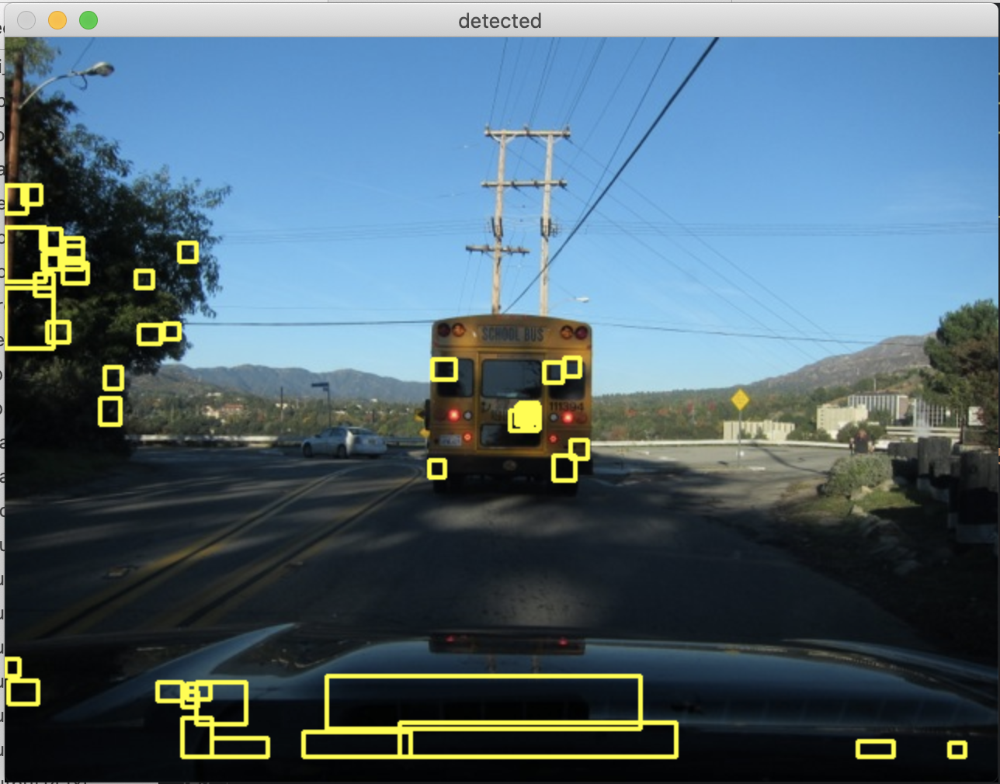

# EE148 HW1

### Jinrui Hou 

##### https://github.com/kinreehou/caltech-ee148-spring2020-hw01

# 1

### 1.

I tried matched filter in the red channel and analyzing the relationships of the RGB values of the candidate areas.


### 2.

I drew the predicted bounding boxes onto the original picture and evaluate the results by my eyes. 

If the red lights are not detected or the bounding boxes are too far away from the red lights in the picture, the algorithms performance is not that good. Conversely, if the bounding boxes can locate red lights precisely, the performance is good.


### 3

Matched filter in the red channel performs the best. (But the result is still not very satisfying)


### 4 


Because all the red lights here are similar to the template with respect of lighting conditions snd sizes.


### 5



In some areas, even though the color is not red, but the RGB value in the Red channel may be similar to a red light, so we may get a similar value to the template of red light after convolution. Also, I just set the threshold by experience, which can be a problem.


### 6

When choosing the template of a red light, I just cropped the red light from a picture. So the template may itself be biased. 


Possible solution: analyze multiple red light pictures and try to generate a template suitable for various lighting conditions.


#### code for best prediction

```python
import os
import numpy as np
import json
from PIL import Image
import matplotlib.pyplot as plt
import seaborn as sns
import pandas as pd
import cv2
from scipy import ndimage


def box(matrix):
	labeled_image, num_features = ndimage.label(matrix)
	# Find the location of all objects
	objs = ndimage.find_objects(labeled_image)

	boxes = []
	for ob in objs:
		boxes.append([int(ob[0].start), int(ob[0].stop), int(ob[1].start), int(ob[1].stop)])
		
	return(boxes)
	

def boxNear(matrix):
	
	def explore(i,j):
		if matrix[i][j]==0:
			return [[i],[j]]
		
		matrix[i][j]=0
		coords = [[i],[j]]
		if i>=1:
			res1 = explore(i-1,j)
			coords[0]+=res1[0]
			coords[1]+=res1[1]
		if i<matrix.shape[0]-1:
			res2 = explore(i+1,j)
			coords[0]+=res2[0]
			coords[1]+=res2[1]
		if j>=1:
			res3 = explore(i,j-1)
			coords[0]+=res3[0]
			coords[1]+=res3[1]
		if j<matrix.shape[1]-1:
			res4 = explore(i,j+1)
			coords[0]+=res4[0]
			coords[1]+=res4[1]
		return coords
		
	boxes = []
	for i in range(matrix.shape[0]):
		for j in range(matrix.shape[1]):
			if matrix[i][j]==1:
				coords = explore(i,j)
				boxes.append([min(coords[0]), min(coords[1]), max(coords[0]), max(coords[1])])
	return boxes
	

	
def template(path='template.jpg'):
	data_path = path
	I = Image.open(data_path)
	I = np.asarray(I)
	red = np.array([[I[i,j,0]*2/255.0-1 for j in range(I.shape[1])]for i in range(I.shape[0])])
	green = np.array([[I[i,j,1]*2/255.0-1 for j in range(I.shape[1])]for i in range(I.shape[0])])
	blue = np.array([[I[i,j,2]*2/255.0-1 for j in range(I.shape[1])]for i in range(I.shape[0])])
	
	return red, green, blue


def detect_red_light(I):
	'''
	Note that PIL loads images in RGB order, so:
	I[:,:,0] is the red channel
	I[:,:,1] is the green channel
	I[:,:,2] is the blue channel
	'''
	bounding_boxes = [] # This should be a list of lists, each of length 4. See format example below. 
	
	temp_all_channel = template(path='template.jpg')
	temp_red = temp_all_channel[0]  #use red channel
	ground_truth = np.sum(temp_red*temp_red)
	h = temp_red.shape[0]
	w = temp_red.shape[1]
	print(h,w)
	red_ch = I[:,:,0]
	conv_res = [[0]*(red_ch.shape[1]-h) for _ in range(red_ch.shape[0]-w)]
	for i in range(red_ch.shape[0]-h):
		for j in range(red_ch.shape[1]-w):
			test_area = red_ch[i:i+h, j:j+w]
			#print(i,j,test_area.shape)
			#print(test_area)
			conv_res[i][j]=abs(np.sum(temp_red*test_area)-ground_truth)
			#print(np.sum(temp_red*test_area))
	conv_res = conv_res/np.max(conv_res)
	conv_res = np.where(conv_res<0.01,1,0) 
	print(conv_res) 
	ax = sns.heatmap(np.array(conv_res))
	#ax = sns.heatmap(np.array(red_ch))
	#plt.show()
	
	boxes_from_red = boxNear(conv_res)	
	#boxes_from_red = box(conv_res)	

	return boxes_from_red
```

#### code for generating example pictures

```python
def predict(boxes, img_path)

	img = cv2.imread(img_path)
  
	for y1,x1,y2,x2 in boxes_from_red:
		cv2.rectangle(img, (x1,y1-8), (x2+8,y2), (0,255,255),2)

	cv2.imshow("detected",img)
	cv2.waitKey(0)
	cv2.destroyAllWindows()
```

